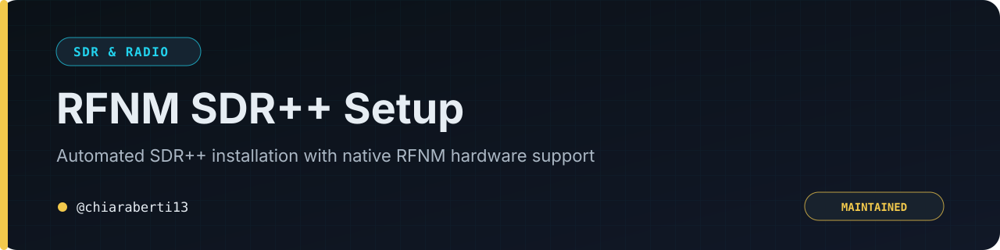

<p align="center"></p>

<p align="center"><a href="README.md">🇬🇧 English</a> · <a href="README.it.md">🇮🇹 Italiano</a></p>

<p align="center">
  
  
  
  
</p>

> Installazione automatizzata di SDR++ con supporto hardware nativo RFNM e SoapySDR.

<p align="center"><a href="SECURITY.md">Sicurezza</a> · <a href="LICENSE">Licenza</a> · <a href="https://github.com/chiaraberti13/Rfnm-sdrpp-setup/issues">Segnala un problema</a></p>

---

## Funzioni dello script

Lo script `setup_rfnm_sdrpp.sh` installa le dipendenze di sistema, compila `librfnm`, configura il modulo `soapy-rfnm` e compila il fork SDR++ con il supporto RFNM e Soapy abilitato.

## Avvio rapido

```bash
git clone https://github.com/chiaraberti13/Rfnm-sdrpp-setup.git
cd Rfnm-sdrpp-setup
chmod +x setup_rfnm_sdrpp.sh
./setup_rfnm_sdrpp.sh
```

Al primo avvio è consigliato utilizzare un profilo pulito:

```bash
sdrpp --root /tmp/sdrpp-clean
```

Per rimuovere componenti e configurazioni installati dallo script:

```bash
chmod +x reset_rfnm_sdrpp.sh
./reset_rfnm_sdrpp.sh
```

## Componenti

- `librfnm`: driver e intestazioni RFNM;
- `soapy-rfnm`: integrazione con SoapySDR;
- `SDR++`: fork con correzioni specifiche per RFNM.

## Sicurezza e responsabilità

Verifica sempre gli script prima di eseguirli con privilegi elevati. Per le segnalazioni consulta [SECURITY.md](SECURITY.md).

## Riferimenti

- [SDR++ upstream](https://github.com/AlexandreRouma/SDRPlusPlus)
- [Fork SDR++ con supporto RFNM](https://github.com/chiaraberti13/SDRPlusPlus)
- [librfnm](https://github.com/rfnm/librfnm)
- [soapy-rfnm](https://github.com/rfnm/soapy-rfnm)

## Licenza

Distribuito con [licenza MIT](LICENSE).
